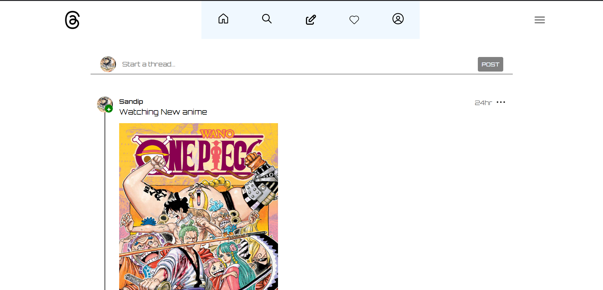
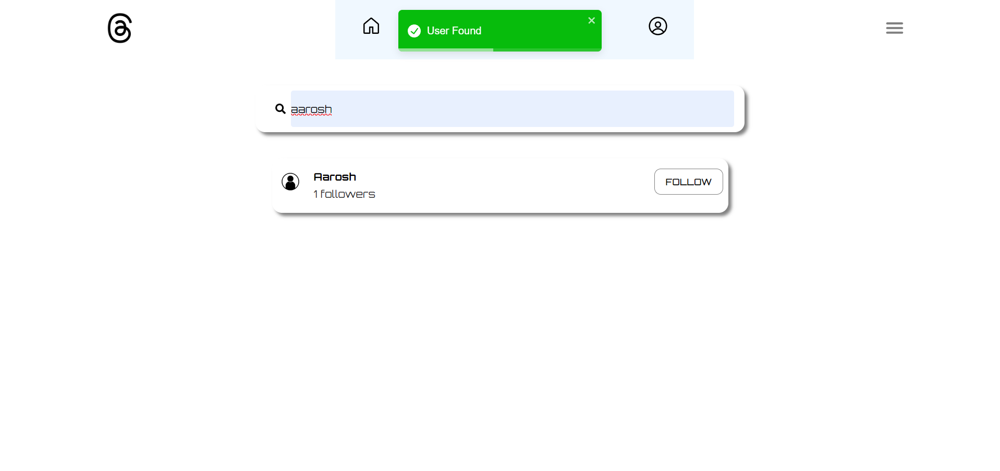
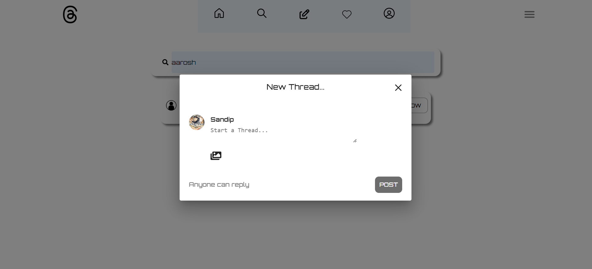
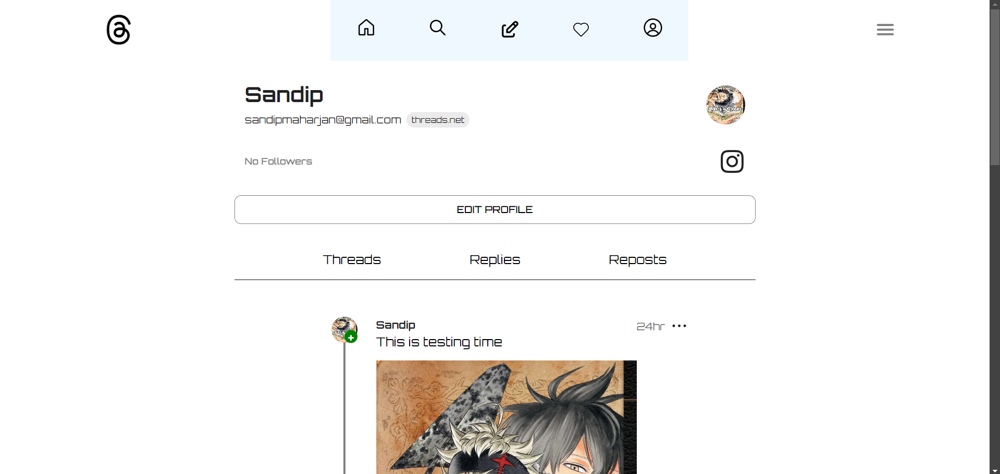

# Thread Clone
   


**Thread Clone** is a social media application built for users to create and manage threads, posts, and comments, designed with a robust backend and an interactive frontend. This project leverages modern web technologies and tools to deliver a seamless user experience.

---

## Features

- **User Authentication:** Secure login and registration with multi-factor authentication (MFA).
- **Post Management:** Create, edit, and delete posts with text and media support.
- **User Interaction:** Add comments, threads, and replies to posts.
- **Media Uploads:** Seamless image uploads integrated with Cloudinary.
- **Responsive Design:** Fully optimized for all screen sizes.
- **Efficient State Management:** Powered by Redux Toolkit for a scalable application.

---

## Technologies Used

### Backend
- **Node.js**: Server-side runtime for scalable applications.
- **Express.js**: Web framework for API development.
- **MongoDB**: NoSQL database for flexible data storage.
- **Mongoose**: ODM for MongoDB.
- **Cloudinary**: Media storage and management.
- **Formidable**: File upload parsing.
- **Passport.js**: Authentication middleware.
- **http-errors**: Error handling utility.

### Frontend
- **React.js**: Frontend library for building user interfaces.
- **Redux Toolkit**: State management.
- **Material Ui**: Frontend component library.
- **TypeScript**: Static type checking.
- **Tailwind CSS**: Utility-first CSS framework.
- **Framer Motion**: Animation library for React.

---

## Installation and Setup

1. Clone the repository:
   ```bash
   git clone https://github.com/sandip95-web/thread_clone.git
   cd thread_clone
   ```

2. Install dependencies:
   - For the backend:
     ```bash
     cd server
     npm install
     ```
   - For the frontend:
     ```bash
     cd client
     npm install
     ```

3. Set up environment variables:
   - Create a `.env` file in the `backend` directory with the following:
     ```plaintext
     MONGO_URI=your_mongodb_connection_string
     CLOUDINARY_NAME=your_cloudinary_name
     CLOUDINARY_API_KEY=your_cloudinary_api_key
     CLOUDINARY_API_SECRET=your_cloudinary_api_secret
     JWT_SECRET=your_jwt_secret
     ```

4. Run the application:
   - Start the backend server:
     ```bash
     cd server
     npm run dev
     ```
   - Start the frontend server:
     ```bash
     cd client
     npm run dev
     ```

---

## Usage

1. Open the frontend in your browser:
   ```
   http://localhost:5173
   ```

2. Register or log in to the application.

3. Create a new post, upload media, and interact with other users' threads.

4. Manage posts, threads, and comments in your profile.


